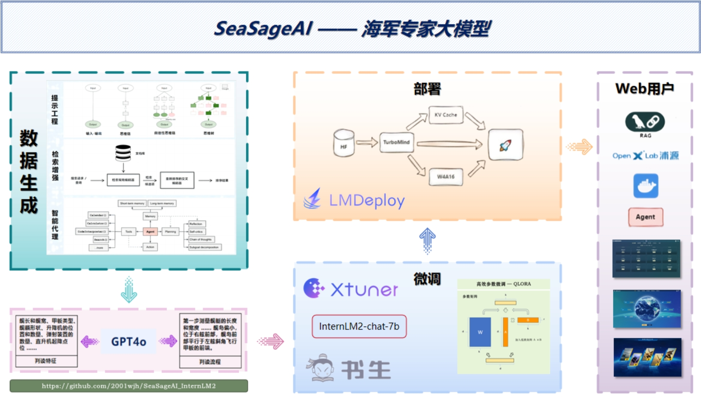

<!-- for modelscope yaml info
---
language:
- zh
tags:
- SeaSageAI_InternLM2
- internlm2
frameworks:
- pytorch
tasks:
- text-generation
license: Apache License 2.0
---
-->
# SeaSageAI_InternLM2

<br />
<!-- PROJECT LOGO -->

<p align="center">
  <a href="https://github.com/2001wjh/SeaSageAI_InternLM2/">
    
  </a>


## 📢 介绍

**SeaSageAI —— 海 J 军迷大模型** 是一个学习整合了大量航海 J 事领域相关知识的领域专家，他的核心能力在于对海J舰艇的分析和认知，通过搜集网络上大量的军情新闻和报导信息，结合 J 事舰艇的判读流程，利用 GPT4o 等先进语言模型生成 J 事舰艇领域的合成数据，用于 InternLM2-chat-7b 模型微调。除此之外，对网络上庞大的 J 事信息进行搜集和整理，作为 RAG 的依据，并辅以改进的 RAG 算法帮助模型找到正确的参考段落。

模型基于 [xtuner](https://github.com/InternLM/xtuner) 微调框架，以 [InternLM2](https://github.com/InternLM/InternLM) 为基座模型进行指令微调，部署方面集成了 LMDeploy **加速推理**🚀，支持 **RAG 检索增强生成**📚做到可以随时更新舰艇信息和公开的J事情报，支持 **Agent 通过互联网搜集公开的J情信息** 🌐，借助专家的视角，让模型对 J 事舰艇形成相当程度的上的判读能力，虽然只能针对文本进行判读，而非图像，但在某种程度上可以从 NLP 的视角帮助热爱 J 情信息的小伙伴更加深入的了解各国海 J 的信息。

**功能点总结：**

- 📜 J 事舰艇相关部件细节信息一键生成
- 🚀 KV cache + Turbomind 推理加速
- 📚 RAG 检索增强生成
- 🌐 Agent 借助互联网查询实时 J 事信息


**开源不易，如果本项目帮到大家，可以右上角帮我点个 star~ ⭐⭐ , 您的 star ⭐是对我最大的鼓励，谢谢各位！**  

## 🎉 NEWS

- [2024.07.17] **项目企划完成**，开始进行相关实验！


## 📌 目录

## 🛠 架构图



## 📺️ 讲解视频

干货满满，欢迎一键三连（疯狂暗示🍺）


## 🖼 演示

**在线体验地址**：


## ⚙ Model Zoo


## 🧱 开发计划

- [] 生成多个J事舰艇判读文本数据集
- [] 模型推理加速
- [] 搜集并整理各大新闻和J情网站的公开军事信息
- [] 将整理好的J情信息接入向量数据库，实现RAG
- [] 支持上传新文档并生成新的 RAG 数据库
- [] 接入 Agent ，实现实时的J情信息检索和访问更新

## 💕 致谢

- [InternLM](https://github.com/InternLM/InternLM)
- [xtuner](https://github.com/InternLM/xtuner)
- [LMDeploy](https://github.com/InternLM/LMDeploy)
- [lagent](https://github.com/InternLM/lagent)

感谢上海人工智能实验室推出的书生·浦语大模型实战营，为我的项目提供宝贵的技术指导和强大的算力支持。

## 🎫 开源许可证

该项目采用 [Apache License 2.0 开源许可证](https://github.com/PeterH0323/Streamer-Sales/LICENSE) 同时，请遵守所使用的模型与数据集的许可证。

## 🔗 引用

如果本项目对您有所帮助，请使用以下格式引用：

```bibtex
@misc{SeaSageAI_InternLM2,
    title={SeaSageAI_InternLM},
    author={wjh2001},
    url={https://github.com/wjh2001/SeaSageAI_InternLM},
    year={2024}
}
```
